# Альфа Офис

Мобильная 2D-игра, которая мотивирует сотрудников приходить в офис. Задания выполняются физически в офисе, за них начисляются альфа-коины, а коины обмениваются на награды: мерч, промокоды, парковку у входа или дополнительный выходной.

Студенческий концепт-проект для Альфа-Банка. Игра нигде не публикуется.

<p align="center">
  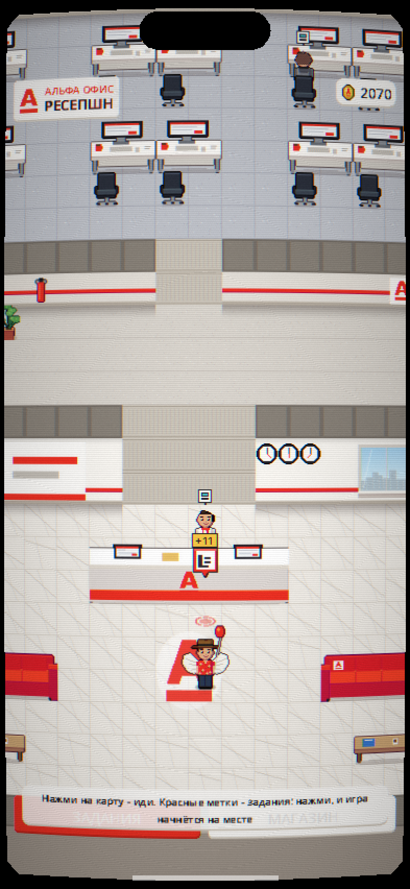
  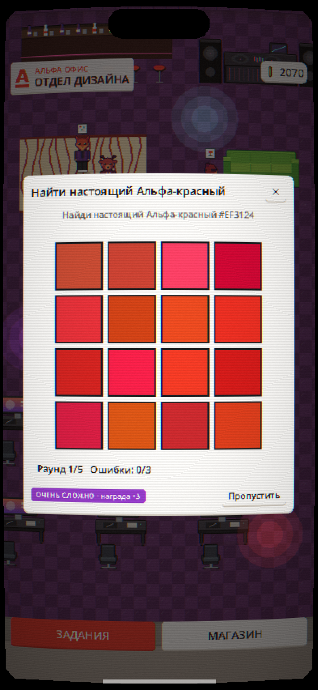
  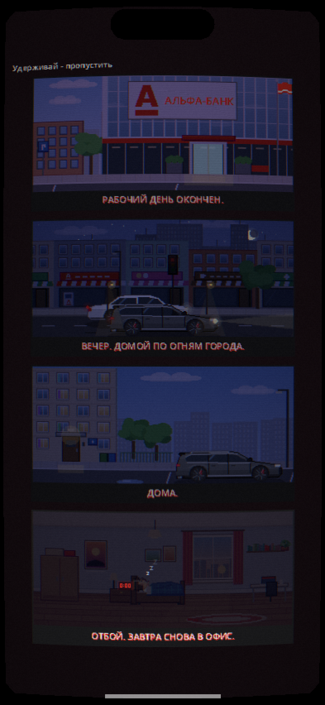
</p>

## Об игре

Игра вертикальная, под одну руку. Визуальный стиль вдохновлён Hotline Miami 2: детализированный пиксель-арт, неон, резкий контраст, CRT-эффект с полосами развёртки и тряска камеры. Квартира и офис показаны в виде 3/4 сверху, а катсцены идут сбоку, как комикс из панелей.

Все спрайты, звуки и персонажи нарисованы и сгенерированы внутри проекта. Ассеты оригинальной Hotline Miami не используются.

## Игровой день

Один игровой день повторяет обычный рабочий день сотрудника.

| Этап | Что происходит |
|---|---|
| Утро | Звенит будильник, персонаж встаёт, чистит зубы и завтракает. Показываются серия дней в офисе, множитель наград, а после пропусков сгоревшая серия и штраф. |
| Дома | Можно погулять по квартире, переодеться в гардеробе, выбрать машину у ключницы и выйти через дверь или ноутбук. |
| Дорога | Катсцена: двор, трасса под ливнем, пробка в городе, парковка у офиса. Сцены зависят от выбранной машины. |
| Офис | Задания на карте, мини-игры, разговоры с коллегами, магазин наград и розыгрыш парковки. На лифте можно подняться на этаж продуктовой аналитики. |
| Вечер | Когда все задания закрыты, персонаж уходит домой: выход из офиса, ночной город, двор, сон. Затем начинается новое утро. |

<table>
  <tr>
    <td align="center">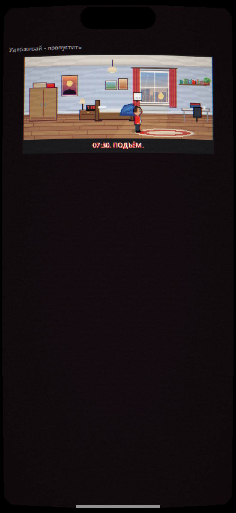<br>Утро</td>
    <td align="center">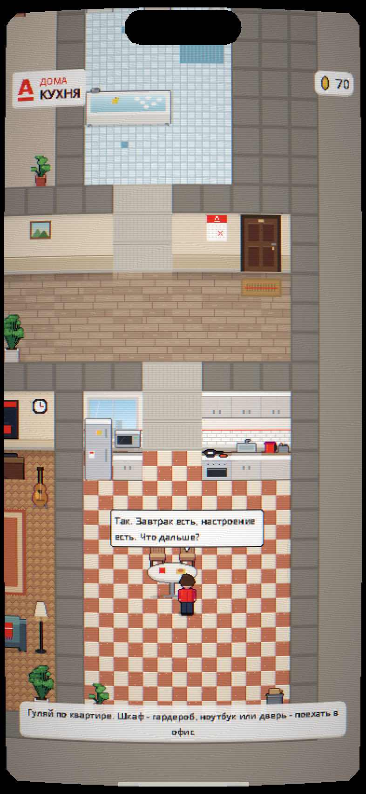<br>Квартира</td>
    <td align="center">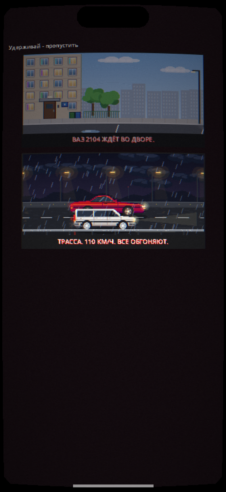<br>Дорога в офис</td>
    <td align="center">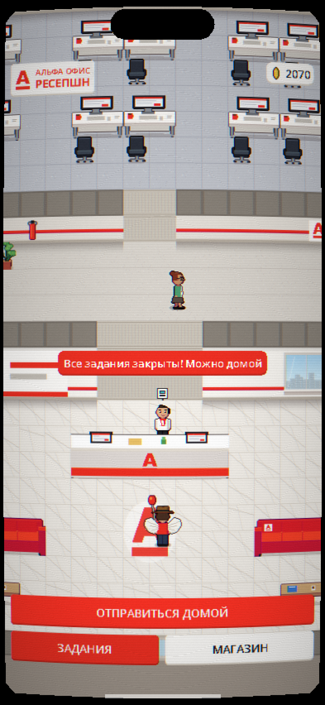<br>День закрыт</td>
  </tr>
</table>

## Механики

### Перемещение

- Нажатие на карту: персонаж идёт в выбранную точку по кратчайшему пути в обход мебели.
- Нажатие с удержанием: персонаж непрерывно идёт за пальцем. Камера следует за персонажем, поэтому достаточно держать палец перед ним.
- Нажатие на коллегу: персонаж подходит и начинает разговор.
- Нажатие на метку задания: персонаж идёт к месту задания, и мини-игра запускается сама.

### Квартира

В квартире пять комнат и больше двадцати интерактивных предметов. У каждого предмета есть свои реплики персонажа: у холодильника, гитары, коробок из-под пиццы и так далее.

| Предмет | Действие |
|---|---|
| Шкаф | Открывает гардероб |
| Ключница | Открывает гараж |
| Ноутбук | Короткий диалог и предложение поехать в офис |
| Входная дверь | Поехать в офис |
| Остальные предметы | Реплики персонажа |

### Задания и мини-игры

Задания выдаёт сервер, у каждого есть место на карте офиса и этаж. Мини-игры физические: они используют камеру,
микрофон, акселерометр, шагомер и QR-коды, поэтому выполнить их можно только в офисе, а не на диване.

| Задание | Что делает игрок | Датчики | Сложность | Награда |
|---|---|---|---|---|
| Отметиться на ресепшне | Сканирует ротируемый QR-код на экране у ресепшна | камера (QR) | Обычная | 10 |
| Донести кофе | Сканирует QR на кухне, несёт телефон ровно, как поднос, и сканирует QR в переговорной | акселерометр + QR | Сложно, x2 | 30 |
| Лестница, не лифт | Проходит 120 шагов по офису за пять минут | шагомер | Обычная | 25 |
| Найди предмет | Показывает камере названные вещи: кружку, растение, монитор, часы | камера, распознавание объектов | Обычная | 25 |
| Утренняя зарядка | Делает 10 приседаний перед фронтальной камерой | камера, распознавание позы | Сложно, x2 | 30 |
| Камертон | Поёт три ноты: до, ми, соль в любой октаве | микрофон | Обычная | 25 |
| Скороговорка | Произносит две скороговорки вслух | распознавание речи | Очень сложно, x3 | 20 |
| Фото с коллегой | Игра назначает коллегу, который сегодня отметился в офисе. Двое встают перед фронтальной камерой, а коллега подтверждает фото у себя в игре | камера, распознавание лиц | Сложно, x2 | 30 |
| Охота за предметами | Находит метки на кулере, растении и логотипе | камера, метки ArUco | Обычная | 40 |

На этаже продуктовой аналитики задания про знакомство с людьми из других департаментов. Коллега
подтверждает встречу своим кодом «Мой QR».

| Задание | Что делает игрок | Сложность | Награда |
|---|---|---|---|
| Кофе вслепую | Игра выбирает коллегу из другого департамента, который сейчас в офисе. Вопросы на карточке помогают начать разговор, после трёх минут беседы игрок сканирует «Мой QR» коллеги | Сложно, x2 | 35 |
| Бинго знакомств | Знакомится с тремя коллегами из трёх разных департаментов (кроме своего) и сканирует их коды | Обычная | 40 |
| Обед с соседями | С 12:00 до 15:30 обедает с кем-то из другого департамента | Обычная | 25 |
| Объясни свою работу | Назначенный коллега и игрок по две минуты рассказывают, чем занимаются | Сложно, x2 | 30 |

Сложные задания отмечены цветной меткой с множителем награды: «Сложно» даёт x2, «Очень сложно» даёт x3. Такие задания можно пропустить. Пропущенное задание закрывается до конца дня без награды.

Кроме множителя сложности результат мини-игры даёт прибавку к награде до 20%: чем ровнее донесён кофе,
чище спета нота и быстрее пройдено задание, тем больше. Потолок прибавки считает сервер.

Если на устройстве нет нужного датчика или игрок не дал разрешение, запускается упрощённая экранная
версия из первого прототипа: наливание кофе, сортировка документов, пупырка или поиск фирменного
красного среди оттенков. В окне игры при этом появляется пометка. Отметка на ресепшне, фото с коллегой и задания на знакомство без камеры недоступны: подделать доказательство присутствия нельзя.

#### Фото с коллегой

1. Игрок начинает задание, сервер назначает коллегу из тех, кто добавлен в игру и сегодня отсканировал
   QR на входе. Карточка показывает, кто это и где он обычно сидит.
2. Двое встают перед фронтальной камерой. Распознавание лиц на телефоне только считает лица (нужно
   минимум два) и никого не опознаёт. Снимок никуда не сохраняется.
3. Задание переходит в статус «Ждёт», а коллеге приходит уведомление: «Такой-то сделал с вами
   совместное фото. Подтвердите, что это правда». После «Да» игрок получает награду, коллега получает
   10 коинов. «Нет» возвращает задание и пишет попытку в журнал подозрительных действий.
4. Неподтверждённый запрос сгорает в конце дня.

<table>
  <tr>
    <td align="center">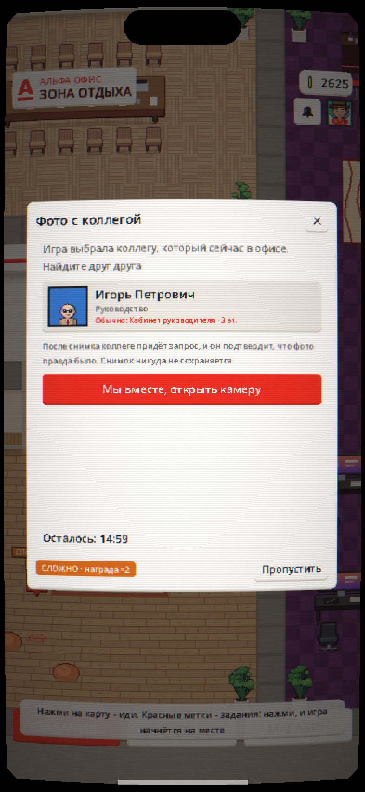<br>Назначенный коллега</td>
    <td align="center">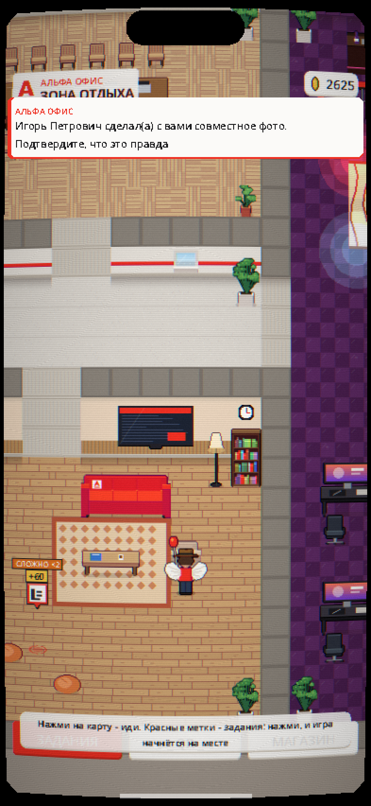<br>Запрос на подтверждение</td>
    <td align="center">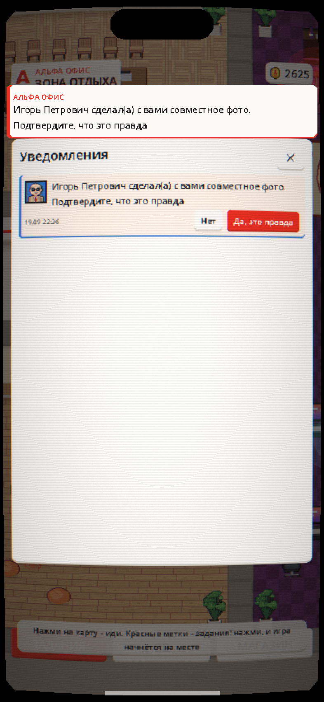<br>Входящие</td>
  </tr>
</table>

<table>
  <tr>
    <td align="center">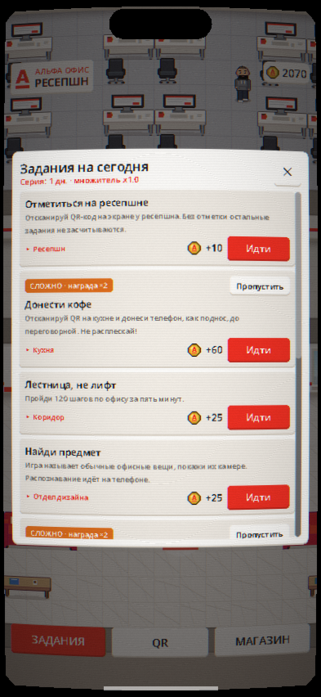<br>Список заданий</td>
    <td align="center">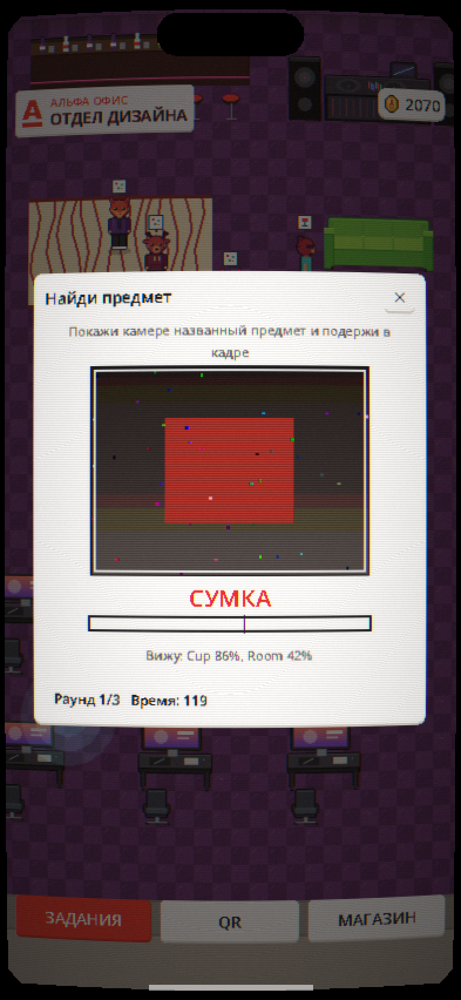<br>Найди предмет</td>
    <td align="center">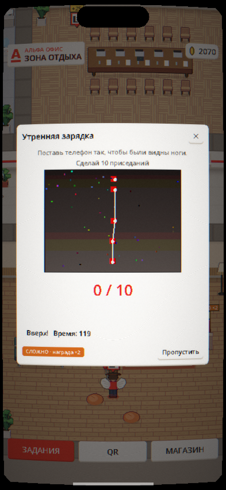<br>Утренняя зарядка</td>
    <td align="center"><br>Донести кофе</td>
  </tr>
  <tr>
    <td align="center">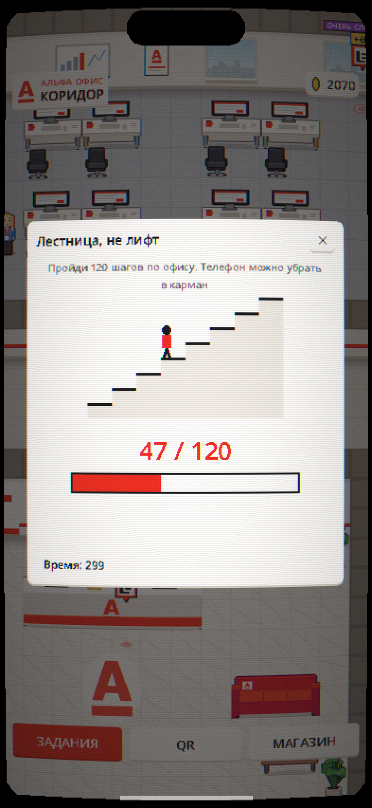<br>Лестница, не лифт</td>
    <td align="center">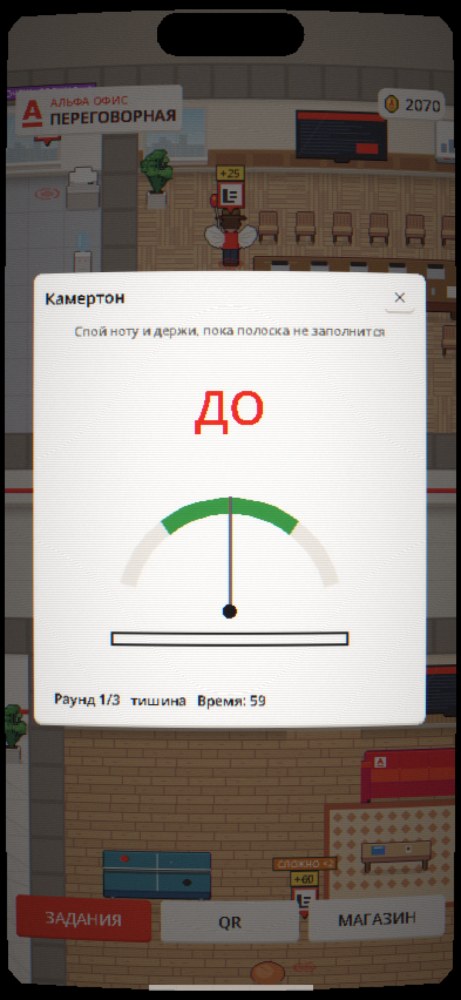<br>Камертон</td>
    <td align="center">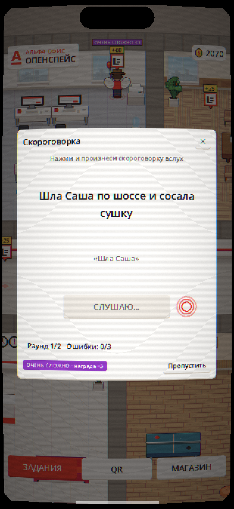<br>Скороговорка</td>
    <td align="center"><br>Фото с коллегой</td>
  </tr>
  <tr>
    <td align="center">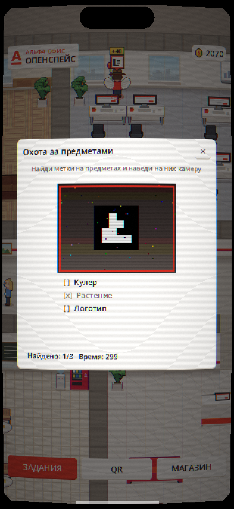<br>Охота за предметами</td>
    <td align="center">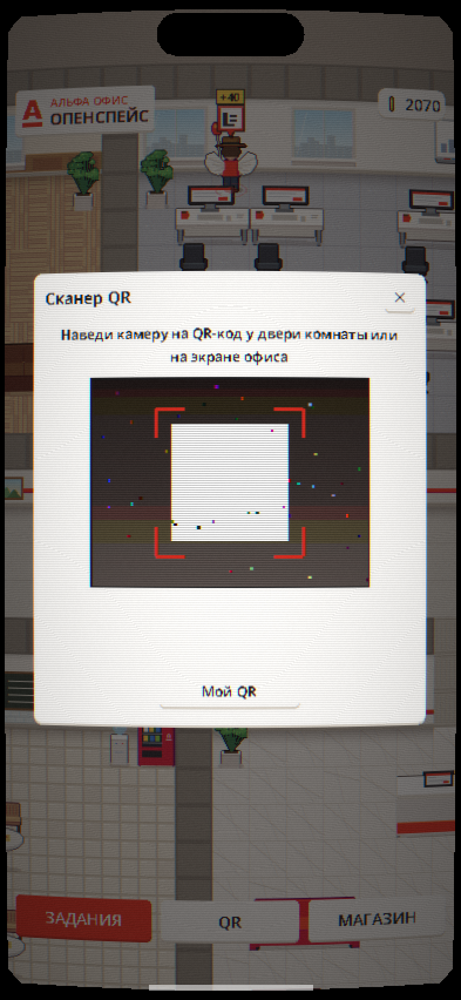<br>Сканер QR</td>
    <td align="center">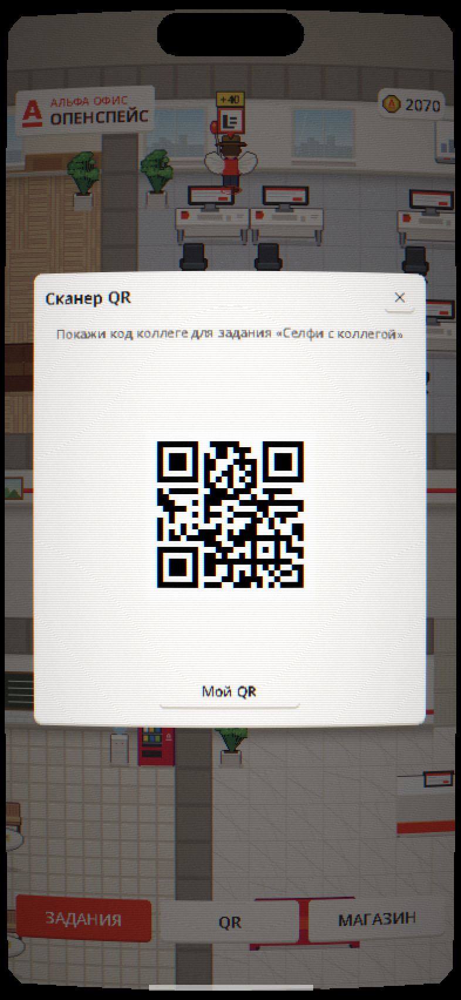<br>Код профиля</td>
    <td align="center">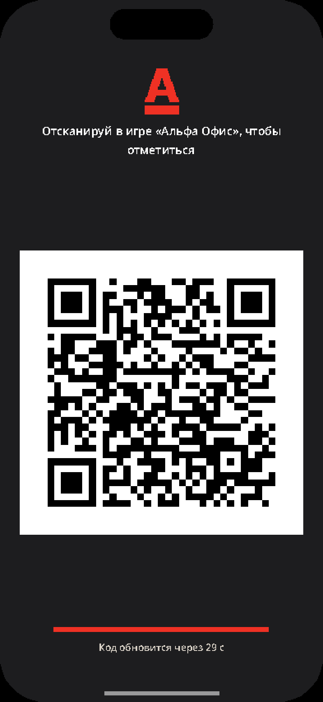<br>Экран у ресепшна</td>
  </tr>
</table>

### QR-коды в офисе

В игре три вида кодов, у каждого своя задача.

| Код | Где висит | Зачем |
|---|---|---|
| Ротируемый QR | экран у ресепшна | Доказательство присутствия: токен живёт 30 секунд, повторно использовать его нельзя |
| Статичный QR комнаты | дверь каждой комнаты | Навигация: после сканирования персонаж сам идёт в эту комнату |
| QR профиля | экран телефона коллеги | Подтверждение встречи в заданиях на знакомство |

Кнопка «QR» в офисе открывает сканер, там же кнопка «Мой QR» показывает собственный код профиля.
Экран для ресепшна запускается из этого же проекта: `run-office-screen.cmd`. Коды комнат и метки ArUco
печатает скрипт `tools/printables/make_printables.py`.

История перемещений не хранится: на сервер уходят только события «задание выполнено в зоне X».
Автоматическое определение комнаты по BLE-маякам отложено, пока комната меняется только по QR.

### Альфа-коины, серия и штрафы

- Итоговая награда: базовая награда, умноженная на коэффициент сложности и на множитель серии.
- Серия считает рабочие дни подряд с отметкой на ресепшне. Выходные серию не прерывают. Множитель начинается с x1.0 и растёт на 0.1 за день серии, максимум x2.0.
- При первом входе начисляется приветственный бонус 500 коинов.
- Действует дневной лимит начислений: 700 коинов.

Пропуски офиса штрафуются прогрессивно. Первый пропущенный рабочий день только сжигает серию. Дальше
за каждый рабочий день подряд без офиса списывается процент от текущего баланса:

| Пропущено рабочих дней подряд | Штраф за день |
|---|---|
| 1 | 0%, сгорает серия |
| 2 | 3% |
| 3-4 | 5% |
| 5-9 | 10% |
| 10 и больше | 15% |

Сумма штрафа округляется вверх, поэтому баланс всегда остаётся целым, и никогда не уходит ниже нуля.
Отпуск и больничный администратор отмечает как уважительные дни, они не считаются пропусками. Пороги и
проценты настраиваются в `client/data/game_rules.json`. Штрафы и сгоревшая серия приходят в уведомлениях
и показываются утром в катсцене.

<table>
  <tr>
    <td align="center">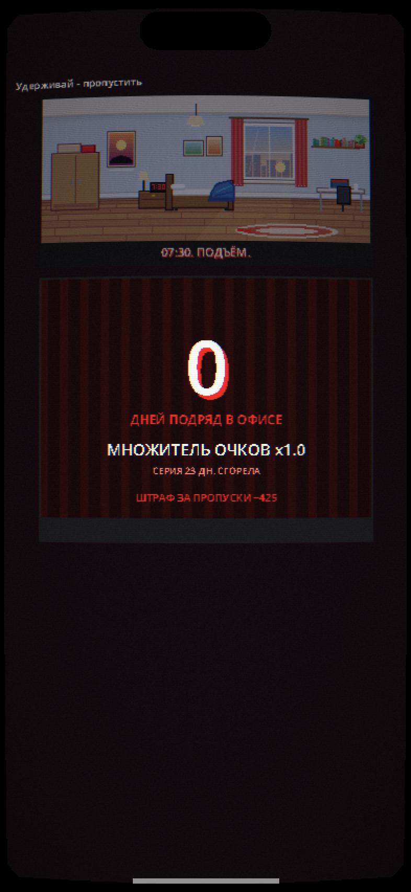<br>Штраф в утренней катсцене</td>
    <td align="center">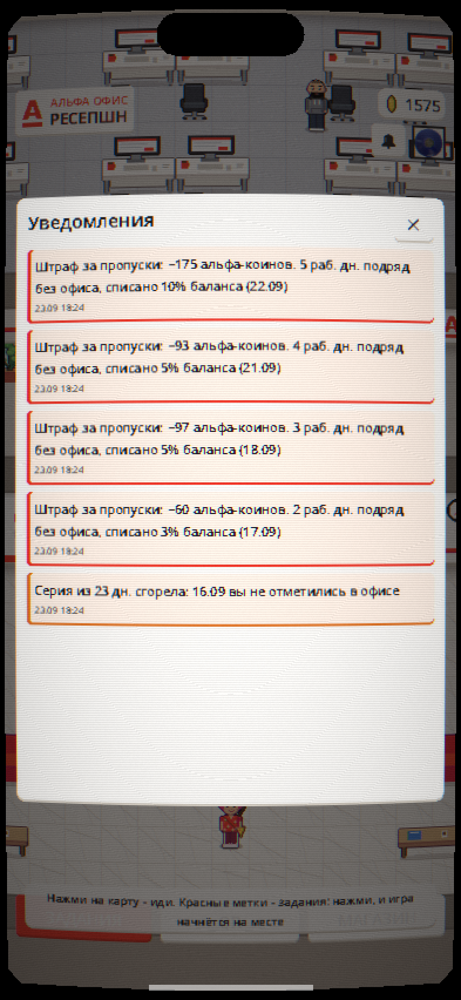<br>Штрафы во входящих</td>
  </tr>
</table>

### Магазин наград

- Каждый день шесть случайных предметов с учётом редкости: обычные, редкие, эпические и легендарные.
- С шансом 40% на один предмет действует скидка от 10 до 50%.
- В каталоге стикеры, кружки, худи, промокоды на кофе, такси, доставку и кино, парковка на неделю, выходной день и день на любой должности.
- Промокоды выдаются сразу. Эпические и легендарные награды уходят на ручное подтверждение.
- Купленный мерч открывает такие же вещи в гардеробе.

### Розыгрыш парковочного места

Отдельная вкладка магазина. Раз в месяц, в последнюю пятницу в 18:00, разыгрывается место на крытом
тёплом паркинге.

- Билет стоит 1 500 коинов, один на игрока. Купить его могут только самые активные: нужно не меньше
  8 дней в офисе за последние 30 дней.
- До розыгрыша идёт обратный отсчёт в формате дни : часы : минуты, видны участники.
- В день подведения итогов открывается рулетка: лента с аватарками участников раскручивается и
  останавливается на победителе. Победителю приходит уведомление.
- Победителя выбирает не анимация, а сервер, по схеме commit-reveal. При создании розыгрыша сервер берёт
  случайное зерно из криптографического генератора и публикует только его SHA-256. После розыгрыша зерно
  раскрывается, а победитель считается как HMAC-SHA256(зерно, id розыгрыша и отсортированный список
  участников) по модулю числа билетов. Заранее результат не знает никто, включая сервер, а проверить его
  потом может любой.

<table>
  <tr>
    <td align="center">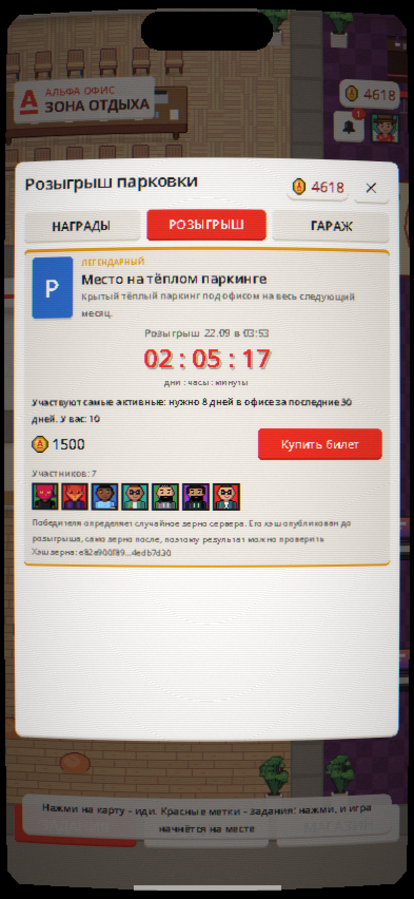<br>Билет и обратный отсчёт</td>
    <td align="center">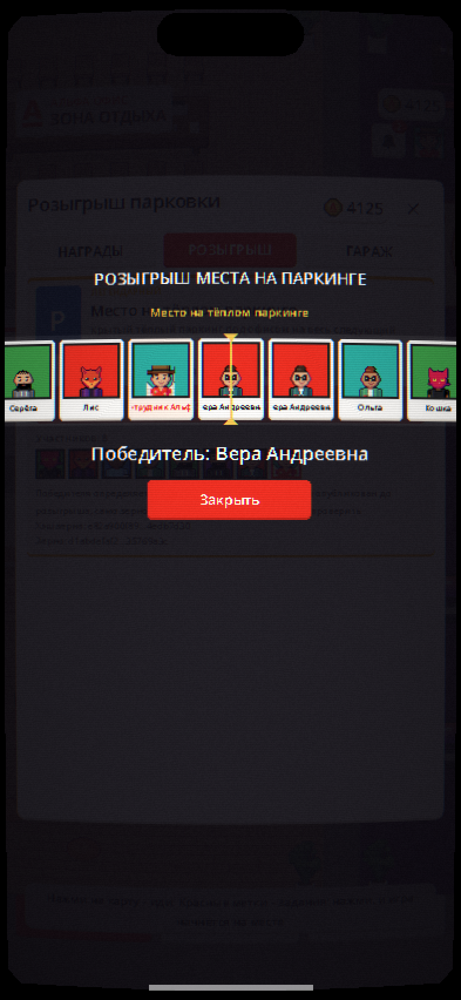<br>Рулетка в день итогов</td>
  </tr>
</table>

### Профиль

Аватарка в правом верхнем углу открывает страницу профиля:

- аватар: 14 готовых портретов персонажей игры (как галерея аватаров в Steam) или своё фото из галереи,
  которое обрезается до квадрата 64x64 прямо на телефоне;
- имя, департамент и статус под аватаркой, до 60 символов;
- серия посещений числом или календарь посещений за 18 недель, как в GitHub: дни в офисе отмечены
  красным, дни с тремя и больше заданиями ярче, по нажатию на день видно, какие задания в нём были;
- статистика: дни в офисе, выполненные задания, заработанные коины и история заданий по дням;
- переключатель уведомлений.

<table>
  <tr>
    <td align="center">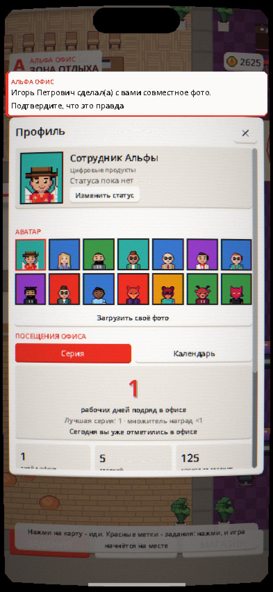<br>Профиль и аватары</td>
    <td align="center">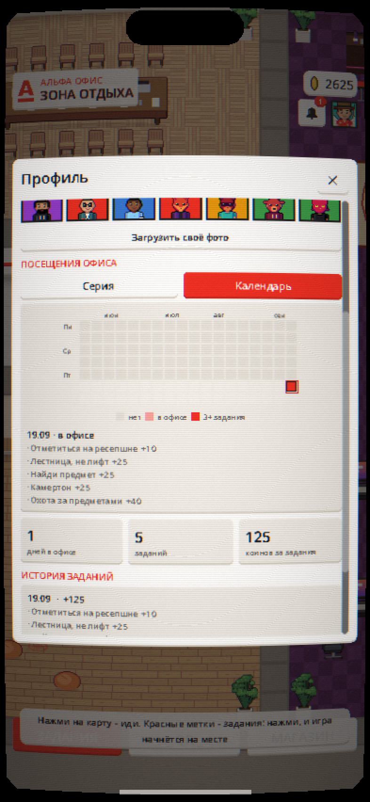<br>Календарь посещений</td>
  </tr>
</table>

Рядом с аватаркой колокольчик с числом непрочитанных. Там штрафы, сгоревшая серия, запросы на
подтверждение совместного фото и итоги розыгрыша.

### Уведомления

| Уведомление | Когда |
|---|---|
| Серия под угрозой: отметься в офисе до 23:59 (дата) | в рабочий день в 9:30, 14:00 и 18:30, пока нет отметки |
| Рабочий день начался, начни новую серию | один раз утром, если серии нет |
| Розыгрыш парковки завтра / через час | за сутки и за час до розыгрыша |
| Победа в розыгрыше | сразу после розыгрыша |
| Коллега сделал с вами фото, подтвердите | сразу после снимка коллеги |
| Серия сгорела, штраф за пропуск | после пропущенного рабочего дня |
| Нейтральные шутки про офис | один-два раза в день в случайное время с 11:00 до 19:30 |

План напоминаний строит сервер (`NotificationPlanner`), клиент отдаёт его системе через
`PlatformServices` и пересобирает при уходе игры в фон. Пока игра открыта, новые события показываются
баннером сверху.

| Платформа | Как работает |
|---|---|
| Android | Локальные уведомления через `AlarmManager` в нативном плагине, разрешение `POST_NOTIFICATIONS` на Android 13+ |
| Web | Notification API браузера. Приходят, пока открыта вкладка; на iPhone только у веб-приложения на экране «Домой» (iOS 16.4+) |
| ПК (отладка) | Баннер внутри игры |
| iOS | Нужен нативный плагин (UserNotifications), пока не сделан |

Уведомления о событиях при закрытой игре (победа, запрос на фото) требуют push с сервера: FCM,
APNs или Web Push. Заглушка сервера этого не умеет, поэтому такие события ждут во входящих.

### Гардероб

Персонаж игрока рисуется прямо в игре из выбранного образа. В гардеробе девять слотов: кожа, волосы, верх, низ, обувь, голова, лицо, спина и предмет в руках. У волос, верха, низа и обуви можно выбрать цвет.

Вещи открываются тремя способами: бесплатно, покупкой мерча в магазине или серией дней в офисе. Персонаж в превью стоит лицом к игроку, повернуть его можно стрелками.

### Гараж

| Машина | Цена | Скорость |
|---|---|---|
| ВАЗ 2104 | Есть с начала | 110 км/ч |
| BMW 5 | 2 500 | 210 км/ч |
| Audi RS6 Avant | 4 000 | 250 км/ч |

Выбранная машина появляется в катсценах. Четвёрка заводится только со второго раза, а на трассе её обгоняют все.

<table>
  <tr>
    <td align="center">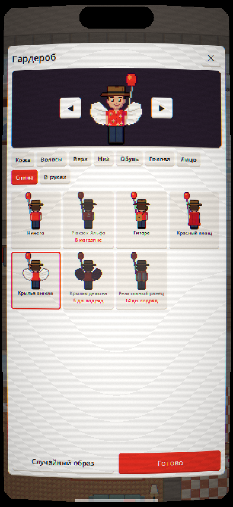<br>Гардероб</td>
    <td align="center">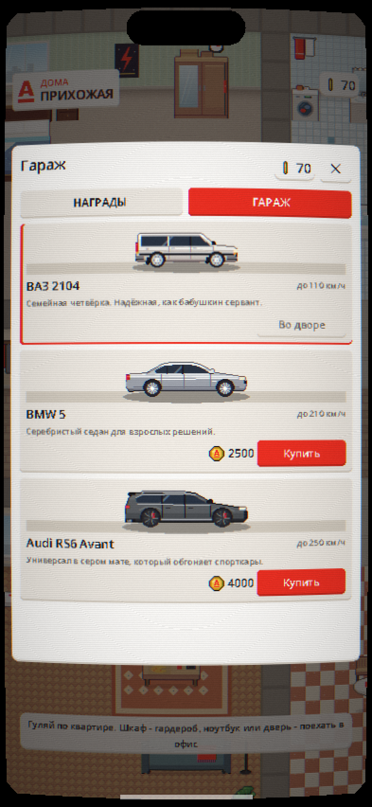<br>Гараж</td>
    <td align="center">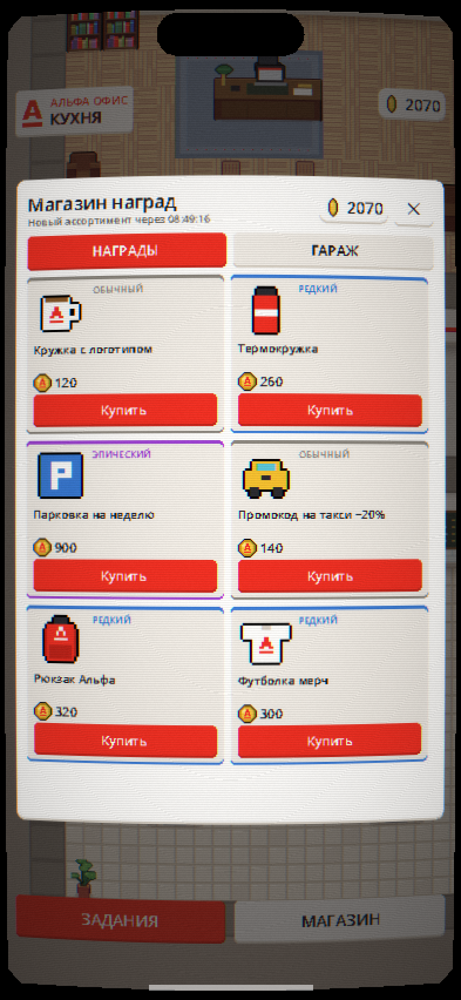<br>Магазин наград</td>
  </tr>
</table>

### Коллеги

По офису ходят девять персонажей со своим распорядком. Они печатают, пьют кофе, говорят по телефону и поливают цветы. Каждого можно позвать на разговор. В отделе дизайна работают звери: Лис, Енот, Олень и Кошка.

### Этаж продуктовой аналитики

Лифт в ресепшне везёт на пятый этаж, в департамент продуктовой аналитики. Технически это такой же этаж:
комнаты, задания, NPC, QR-коды дверей. Но интерьер свой: бирюзовый ковролин в опенспейсе, бетон и
неоновая подсветка в дата-лабе, стена дашбордов, канбан-доска со стикерами, воронка на доске,
стоячие столы и переговорные кабинки. Комнаты: опенспейс, дата-лаб, кофе-поинт, переговорная
«Гипотеза» и лифтовый холл.

Здесь работают Маша (A/B-тесты), Тимур (data science), Вера Андреевна (руководитель) и Костя (SQL), у
каждого свои реплики. Если задание находится на другом этаже, персонаж сам идёт к лифту. Сканирование
QR-кода комнаты с другого этажа тоже перевозит игрока туда.

<table>
  <tr>
    <td align="center">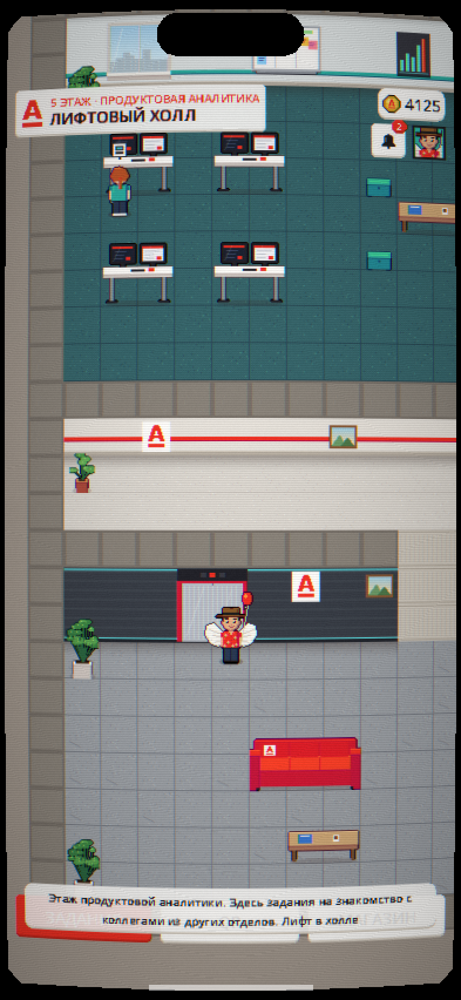<br>Лифтовый холл</td>
    <td align="center">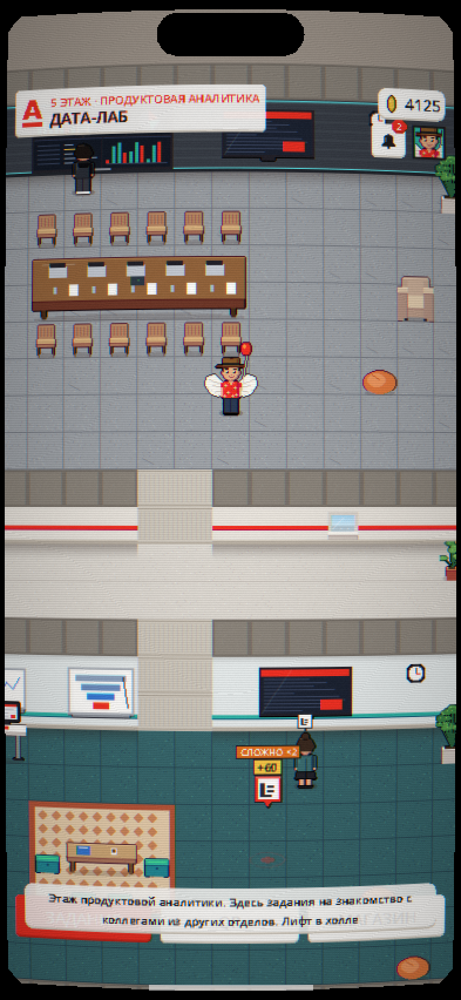<br>Дата-лаб</td>
    <td align="center">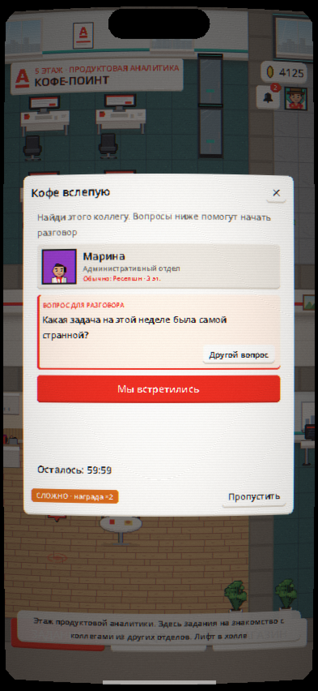<br>Кофе вслепую</td>
  </tr>
</table>

<p align="center">
  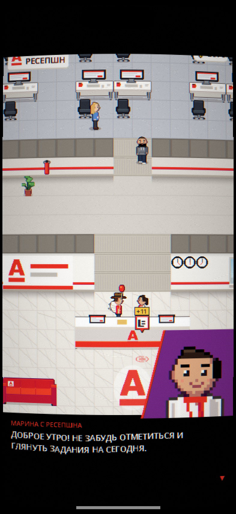
</p>

## Правила сервера

Клиент ничего не решает сам. Он отправляет действие, а сервер проверяет его и меняет состояние.

- Коины начисляются и списываются только через кошелёк сервера, каждая операция пишется в журнал.
- Все запросы, которые меняют баланс, идемпотентны: у каждой операции есть уникальный ключ.
- Присутствие в офисе подтверждается минимум двумя факторами: ротируемым QR-кодом на экране в офисе и внешним IP офисной сети. Проверка IP появится вместе с настоящим сервером, опционально добавится BLE-маяк.
- Пока игрок не отметился на ресепшне, остальные задания не засчитываются.
- Результат мини-игры считается на клиенте, поэтому влияет только на прибавку к награде с потолком, а не на сам факт выполнения.
- Антифрод: дневной лимит начислений, запрет повторного использования QR-токена, проверка коллеги (назначен сервером, отметился сегодня в офисе, не свой код, не дважды за день, для заданий на знакомство из другого департамента), подтверждение совместного фото вторым игроком, журнал подозрительных действий, ручное подтверждение дорогих наград.
- Штрафы за пропуски и розыгрыш считает только сервер. Баланс не бывает отрицательным.

Сейчас серверные правила работают в локальной заглушке `MockBackend` (`client/scripts/services/mock`). Её интерфейс повторяет будущие RPC Nakama, поэтому замена не затронет игровой код. Других игроков заглушка имитирует по `client/data/colleagues.json`: кто сегодня в офисе, решается случайно на каждый день, фото они подтверждают через 20 секунд, билеты на розыгрыш покупают сами.

## Технологии

| Часть | Стек |
|---|---|
| Клиент | Godot 4.7.2, GDScript со строгой типизацией, рендерер Compatibility |
| Сборки | Android собирается локально, iOS позже, запасной вариант: Web-экспорт |
| Графика | Базовое разрешение 360x640, целочисленное масштабирование, тайлы 32 px, персонажи 32x48 px |
| Эффекты | Шейдеры CRT и камеры, тряска камеры, частицы |
| Тесты и линт | GdUnit4 6.2.1, gdtoolkit 4.5.0 (`gdlint`, `gdformat`) |
| Сервер (план) | Nakama, модуль на Go, PostgreSQL |
| Админка (план) | React, TypeScript, Vite |

### Датчики и мини-игры

Игровой код обращается только к автозагрузке `PlatformServices`, она выбирает реализацию под платформу.

| Функция | Android (v1) | ПК (отладка) | Web (v2, план) |
|---|---|---|---|
| Камера, кадры превью | CameraX 1.4.2, кадр 160 px по длинной стороне | синтетический кадр | `getUserMedia` |
| QR-коды | ML Kit barcode-scanning 17.3.0 | список кодов в панели эмулятора | jsQR |
| Лица и улыбки | ML Kit face-detection 16.1.7 | клавиши F и G | MediaPipe Tasks |
| Предметы в кадре | ML Kit image-labeling 17.0.9 | кнопки на панели | MediaPipe Tasks |
| Поза для приседаний | ML Kit pose-detection 18.0.0-beta5 | клавиша S | MediaPipe Tasks |
| Метки предметов | OpenCV 4.12.0, ArUco `DICT_4X4_50` | клавиши 1-9 | OpenCV.js |
| Шаги | `SensorManager`, `TYPE_STEP_COUNTER` | клавиша W | нет |
| Речь | `SpeechRecognizer`, ru-RU, офлайн при поддержке | поле ввода в панели | Web Speech API |
| Наклон телефона | `Input.get_accelerometer()` | стрелки и пробел | DeviceMotion |
| Микрофон и высота тона | `AudioStreamMicrophone` + `AudioEffectCapture`, алгоритм YIN в GDScript | то же | то же |
| BLE-маяки | отложено | - | не поддерживается |

Предметы для игры «Найди предмет» выбраны из меток базовой модели ML Kit: кружка, растение, монитор,
стул, часы, маркерная доска, бумаги, сумка. У каждого предмета несколько допустимых меток (кружка - это
`Cup`, `Coffee` или `Cappuccino`), порог уверенности 0.55. Модель встроена в приложение, ничего не
скачивается и не отправляется наружу.

Кадры камеры и звук не покидают устройство: плагин отдаёт в игру только результаты (точки скелета,
рамки лиц, номера меток, текст кода) и уменьшенный кадр для превью.

QR-коды игра не только читает, но и рисует: свой кодировщик (`client/scripts/qr/qr_encoder.gd`,
версии 1-10, уровень коррекции M) печатает код профиля и код на экране у ресепшна.

### Нативный Android-плагин

`native/android` - библиотека Godot Android Plugin v2 на Kotlin. Она собирается в AAR, а редакторский
плагин `client/addons/office_game_android` подключает AAR и его зависимости к экспорту.

| Инструмент | Версия |
|---|---|
| JDK | Temurin 17 |
| Android Gradle Plugin | 8.6.1, как в шаблоне сборки Godot 4.7.2 |
| Kotlin | 2.1.21 |
| Gradle | 8.11.1 |
| Android SDK | compileSdk и targetSdk 36, build-tools 36.1.0, minSdk 24 |
| ABI | только arm64-v8a |

Разрешения: `CAMERA`, `RECORD_AUDIO`, `ACTIVITY_RECOGNITION`, `POST_NOTIFICATIONS`. Датчики игра запрашивает
перед стартом мини-игры, а при отказе переключается на упрощённую версию задания. Уведомления
запрашиваются при первом запуске.

### Инструменты разработчика

| Скрипт | Что делает |
|---|---|
| `tools/setup-android.ps1` | Ставит JDK, Android SDK, шаблоны экспорта Godot и отладочный ключ в `tools/` |
| `tools/build-android.ps1` | Собирает плагин и экспортирует APK |
| `tools/printables/make_printables.py` | Печатные QR комнат и метки ArUco |
| `client/tools/check_scripts.gd` | Проверяет, что все скрипты компилируются |
| `client/tools/dev_tour.gd` | Автоматический тур по игре со скриншотами |
| `client/data/game_rules.json` | Штрафы, напоминания, розыгрыш и подтверждение фото |

## Структура репозитория

```
client/
  addons/       плагины Godot: GdUnit4 и редакторский плагин Android-экспорта
  assets/       спрайты, тайлы, звуки, арт катсцен
  data/         контент заглушки сервера: задания, магазин, гардероб, машины, диалоги, коллеги, правила
  localization/ строки на русском и английском
  platform/     PlatformServices: Android, Web и эмуляция датчиков на ПК
  scenes/       сцены Godot, включая экран у ресепшна
  scripts/      игровой код: мир, персонажи, UI, мини-игры, QR, катсцены, сервисы
  shaders/      шейдеры CRT и камеры
  tests/        тесты GdUnit4
  tools/        генераторы арта и звука, автоматический тур, проверка скриптов
native/
  android/      Kotlin-плагин: камера, ML Kit, OpenCV, шагомер, распознавание речи, уведомления
tools/          локальный тулчейн, скрипты сборки, печатные материалы
run.ps1         запуск на компьютере с эмуляцией телефона (Windows)
run.sh          то же для macOS
run-office-screen.cmd  экран у ресепшна с ротируемым QR
```

## Запуск

1. Скачайте Godot 4.7.2 для Windows (win64) и распакуйте в `tools/godot`.
2. Запустите игру в эмуляторе телефона:

```powershell
.\run.ps1 -Device iphone_15
```

Или откройте `run-android.cmd` (Pixel 8) или `run-ios.cmd` (iPhone 15).

На macOS:

```bash
brew install --cask godot
./run.sh --device iphone_15
./run.sh --device iphone_17_pro --screen-dpi 127
./run.sh --office-screen
```

`run.sh` ищет Godot в `tools/godot/Godot.app`, затем в `PATH`, затем в `/Applications`. На клавиатуре Mac клавиши F1–F7 из таблицы ниже нажимаются вместе с `fn`.

Доступные устройства: `pixel_8`, `iphone_15`, `iphone_17_pro`, `iphone_17_pro_max`, `galaxy_s24`, `android_hd`, `iphone_se`, `desktop`.

Окно эмулятора открывается в физическом размере экрана телефона. Размер считается по плотности пикселей телефона и DPI монитора. Если Windows сообщает DPI неточно, укажите его вручную:

```powershell
.\run.ps1 -Device iphone_17_pro -ScreenDpi 109
```

| Клавиша | Действие |
|---|---|
| F1 | Подсказка: устройство, размер экрана и окна в мм |
| F2 | Следующее устройство |
| F3 | Включить или выключить CRT-эффект |
| F4 | Показать безопасную зону экрана |
| F5, F6 | Уменьшить или увеличить окно |
| F7 | Реальный размер или окно на весь экран |
| F8 | Розыгрыш парковки через минуту |
| F9 | Коллега просит подтвердить совместное фото |
| F10 | Прошёл день: штрафы и сгоревшая серия, офис перезагружается |

Прогресс заглушки сервера хранится в `user://mock_backend.json`. Чтобы начать с нуля, удалите этот файл.
В списке QR-кодов эмулятора есть коды профилей всех коллег; звёздочкой отмечены те, кто сегодня в офисе.

### Эмуляция датчиков на ПК

Мини-игры физические, но на компьютере их всё равно можно пройти: в отладочной сборке `PlatformServices`
подставляет эмулятор датчиков. Пока мини-игра работает, сверху появляется чёрная панель с подсказками.

| Клавиша | Действие |
|---|---|
| Стрелки | Наклон телефона (для «Донести кофе») |
| Пробел | Резкий толчок, кофе плещется |
| W | Шаги (удерживать) |
| S | Приседание (удерживать) |
| F | Число лиц в кадре, G - улыбка |
| 1-9 | Метка ArUco в кадре, 0 - убрать |

QR-коды и предметы перед камерой выбираются кнопками на панели, скороговорка вводится текстом.
Микрофон работает настоящий, поэтому «Камертон» можно пройти голосом.

### Экран у ресепшна

```powershell
.\run.ps1 -OfficeScreen
```

Открывает полноэкранный ротируемый QR-код. В отладочной сборке токен подписывается локальным секретом
из переменной окружения `OFFICE_GAME_PRESENCE_SECRET` (если она не задана, используется значение для
разработки). На настоящем сервере секрет останется только на сервере, а экран будет запрашивать токен
по RPC.

### Печатные материалы

```powershell
pip install -r tools/requirements.txt
python tools/printables/make_printables.py --out build/printables
```

Делает по странице на каждую комнату (QR у двери) и на каждую метку ArUco, плюс общий `printables.pdf`.

### Тесты и проверки

```powershell
tools\godot\Godot_v4.7.2-stable_win64_console.exe --headless --path client -s -d res://addons/gdUnit4/bin/GdUnitCmdTool.gd -a res://tests --ignoreHeadlessMode -c
```

```powershell
tools\godot\Godot_v4.7.2-stable_win64_console.exe --headless --path client res://tools/check_scripts.tscn
```

```powershell
pip install -r tools/requirements.txt
gdlint client
```

### Сборка APK

```powershell
.\tools\setup-android.ps1
.\tools\build-android.ps1
```

Первый скрипт ставит JDK, Android SDK и шаблоны экспорта в `tools/` (ничего в систему), второй собирает
Kotlin-плагин и экспортирует `build/android/office-game-debug.apk`. Ключ `-Install` ставит APK на
подключённый телефон, `-Release` собирает релизную сборку (для неё нужен свой ключ подписи в переменных
окружения `GODOT_ANDROID_KEYSTORE_RELEASE_PATH`, `..._USER`, `..._PASSWORD`).

### Автоматический тур

Тур проходит утро, квартиру, дорогу, офис и вечер, открывает каждую мини-игру, подставляет показания датчиков, заглядывает в сканер QR и на экран у ресепшна, открывает профиль, входящие и розыгрыш, едет на этаж аналитики, нажимает на объекты и сохраняет скриншоты. Скриншоты в этом README сделаны им.

```powershell
tools\godot\Godot_v4.7.2-stable_win64_console.exe --path client res://tools/dev_tour.tscn -- --device=iphone_15 --out=C:/shots --shot-scale=2
```

## Статус

Готов прототип клиента: квартира, два этажа офиса, катсцены, физические мини-игры и задания на
знакомство, магазин с розыгрышем парковки, профиль, уведомления, штрафы, гардероб и гараж на локальной
заглушке сервера. Работают сканирование QR-кодов, переход по комнатам офиса, нативный
Android-плагин (камера, ML Kit, OpenCV, шагомер, распознавание речи) и экран у ресепшна с ротируемым кодом.

Дальше по плану: сервер на Nakama с проверкой внешнего IP офиса и push-уведомлениями (FCM, APNs, Web Push),
админка для заданий, каталога наград, уважительных пропусков и модерации аватарок, плагин для iOS,
BLE-маяки вместо ручного сканирования кодов комнат и веб-версия датчиков.

## Лицензия

Некоммерческая лицензия для личного использования с указанием авторства. Текст лицензии в файле [LICENSE](LICENSE).
